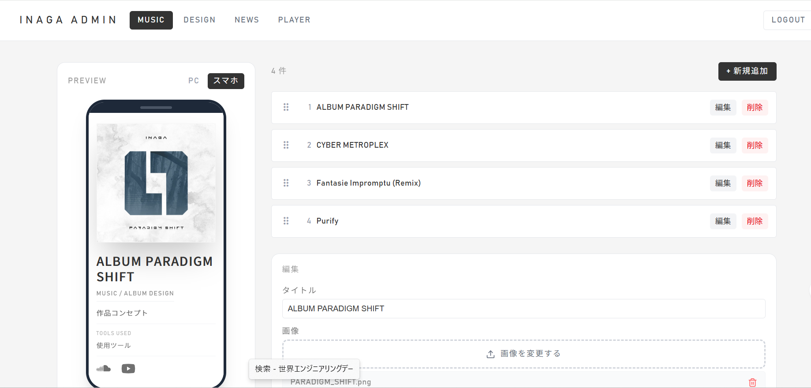
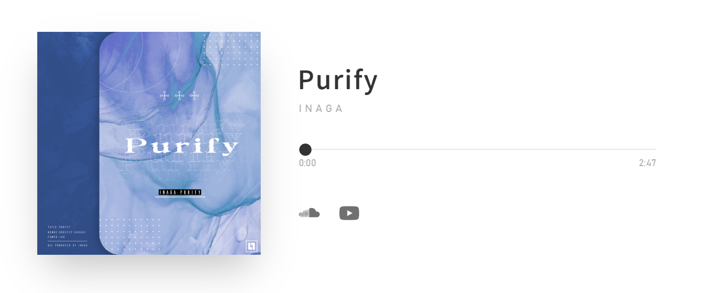

# inaga - portfolio

音楽・グラフィックデザイン作品のポートフォリオサイト。
**https://inagainaga.vercel.app**

---

## 技術スタック

| カテゴリ | 使用技術 |
|---------|---------|
| フレームワーク | Next.js 16 (App Router) |
| 言語 | TypeScript |
| スタイリング | Tailwind CSS v4 |
| アニメーション | Framer Motion |
| D&D | @dnd-kit |
| デプロイ | Vercel |
| コンテンツ管理 | GitHub API（管理画面からコミット） |

---

## スクリーンショット

---

## 主な機能

- **フルスクリーンロゴ** — インパクトのあるファーストビュー
- **横スクロールギャラリー** — MUSIC / DESIGN 作品を横スクロールで閲覧
- **埋め込みプレイヤー** — メインページでサンプル楽曲を再生（音声ビジュアライザー付き）
- **作品詳細ページ** — 各作品の専用ページを自動生成
- **SNSリンク** — SoundCloud / YouTube / Niconico / Spotify / Apple Music / Amazon Music
- **管理画面** — コードを触らずに作品・ニュースを追加・編集・削除・並び替え

---

## 技術的なこだわり

**データベース不使用のコンテンツ管理**
`data/works.json` を GitHub API 経由で直接更新することで、データベースやヘッドレス CMS を使わずにコンテンツ管理を実現している。管理画面からの操作が GitHub コミットとなり、Vercel の自動リビルドでサイトに反映される。

**Web Audio API による音声ビジュアライザー**
ブラウザ標準の Web Audio API を用いてリアルタイムの音声解析を行い、再生中の音楽に連動したビジュアルをキャンバスに描画している。

**SEO 対応**
Next.js の Metadata API・`sitemap.ts`・`robots.ts`・JSON-LD（Person スキーマ）を組み合わせ、検索エンジンへの最適化を実装している。

---

## Credits

- **Artist / Creator** : いなが
- **Developer** : oganesson
