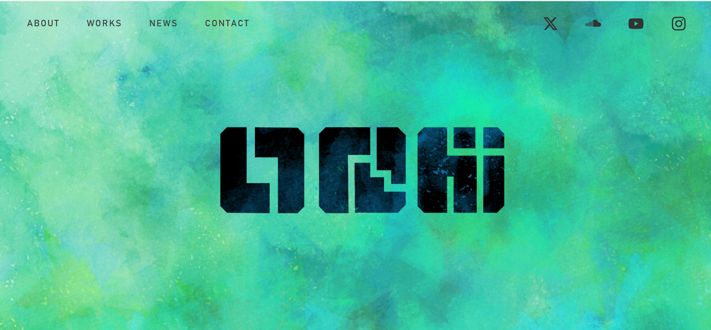
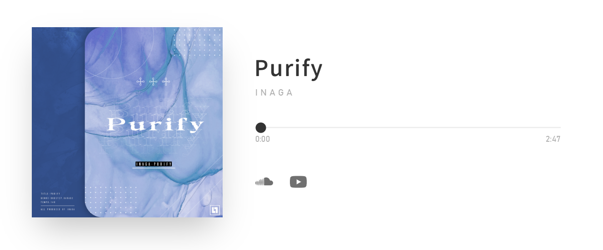
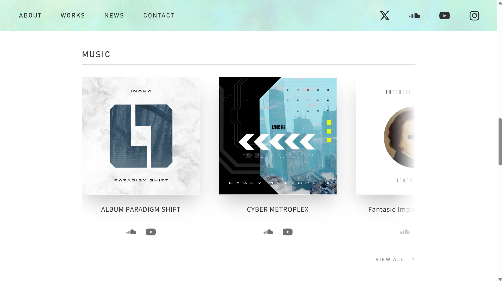
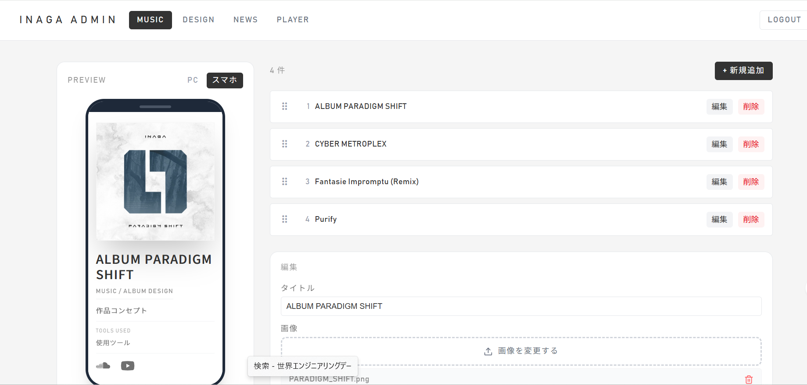

# inaga - portfolio

音楽・グラフィックデザイン作品のポートフォリオサイト。
**https://inagainaga.vercel.app**

---

## 技術スタック

| カテゴリ | 使用技術 |
|---------|---------|
| フレームワーク | Next.js 16 (App Router) |
| 言語 | TypeScript |
| スタイリング | Tailwind CSS v4 |
| アニメーション | Framer Motion / CSS Keyframes |
| D&D | @dnd-kit |
| デプロイ | Vercel |
| コンテンツ管理 | GitHub API（管理画面からコミット） |

---

## 主な機能

**ロゴアニメーション × ヒーロー演出** — 「いなが」の文字を一画ずつ SVG で描き起こし、筆順に沿って順番にワイプで出現。完了後、水彩テクスチャ背景とロゴ画像がふわっとフェードインする。

---

**埋め込みプレイヤー** — メインページでサンプル楽曲をそのまま再生。アートワーク・タイトル・シークバー・SNS リンクを一体化したプレイヤーを表示。

---

**横スクロールギャラリー** — MUSIC / DESIGN 作品をカード形式で横スクロール閲覧。SNS リンクも各カードに表示。

---

**作品詳細ページ** — 各作品の専用ページを自動生成。

**SNSリンク** — SoundCloud / YouTube / Niconico / Spotify / Apple Music / Amazon Music

---

**管理画面** — コードを触らずに作品・ニュースの追加・編集・削除・並び替えが可能。スマホ／PC プレビューを確認しながら編集でき、変更はまとめて GitHub にコミットされる。SEO（title・description）も管理画面から編集できる。

---

**デザインノート** — サイトのデザインシステム（カラーパレット・タイポグラフィ・レイアウト・コンポーネント）をまとめた自己満足ページ。フッターの "DEVELOPED" リンクからアクセス。こだわりノートはパスワード付き管理画面（`/design-notes/admin`）で追加・編集・削除できる。

---

## 技術的なこだわり

**SVG ストロークアニメーション**
「いなが」の各文字を一画ずつ SVG `<path>` として定義し、CSS の `clip-path: inset()` アニメーションでワイプ効果を実現。筆順・方向（上→下・下→上・左→右）・速度を細かく制御し、動画素材を Python + OpenCV で解析して実際の手書き順序に合わせた。アニメーション完了後に水彩テクスチャ背景とロゴ画像が同時にフェードインし、ヘッダーも同タイミングで出現する。

**データベース不使用のコンテンツ管理**
`data/works.json` を GitHub API 経由で直接更新することで、データベースやヘッドレス CMS を使わずにコンテンツ管理を実現している。管理画面からの操作が GitHub コミットとなり、Vercel の自動リビルドでサイトに反映される。

**Web Audio API による音声ビジュアライザー**
ブラウザ標準の Web Audio API を用いてリアルタイムの音声解析を行い、再生中の音楽に連動したビジュアルをキャンバスに描画している。

**SEO 対応**
Next.js の Metadata API・`sitemap.ts`・`robots.ts`・JSON-LD（Person スキーマ）を組み合わせ、検索エンジンへの最適化を実装している。title・description は管理画面から動的に編集可能。

---

## Credits

- **Artist / Creator** : いなが
- **Developer** : oganesson
